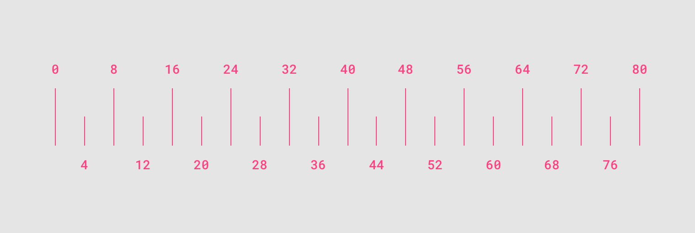
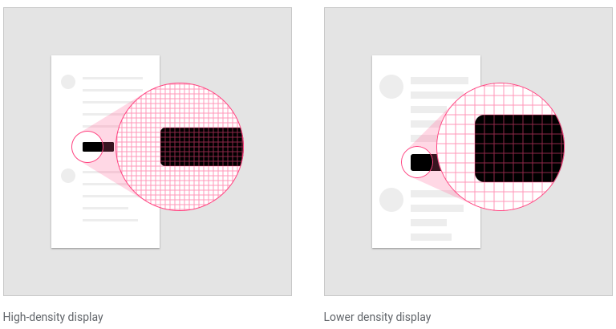
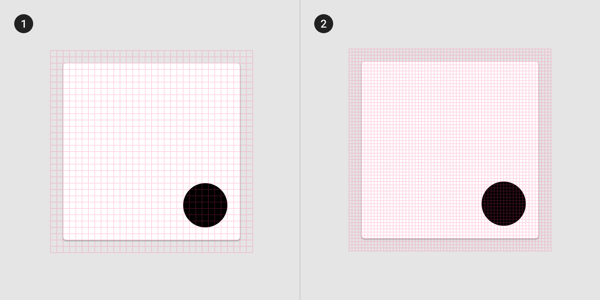
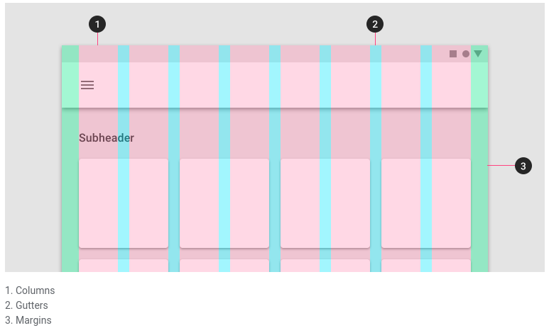
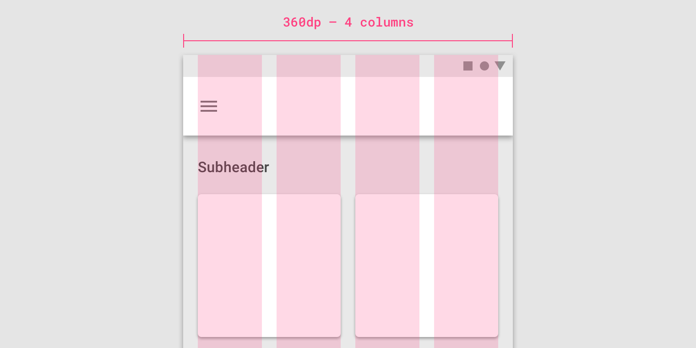
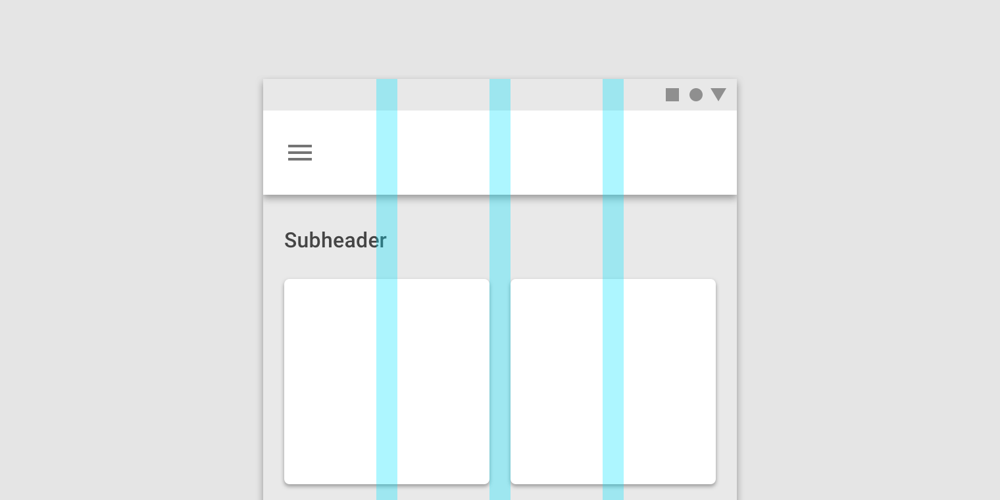
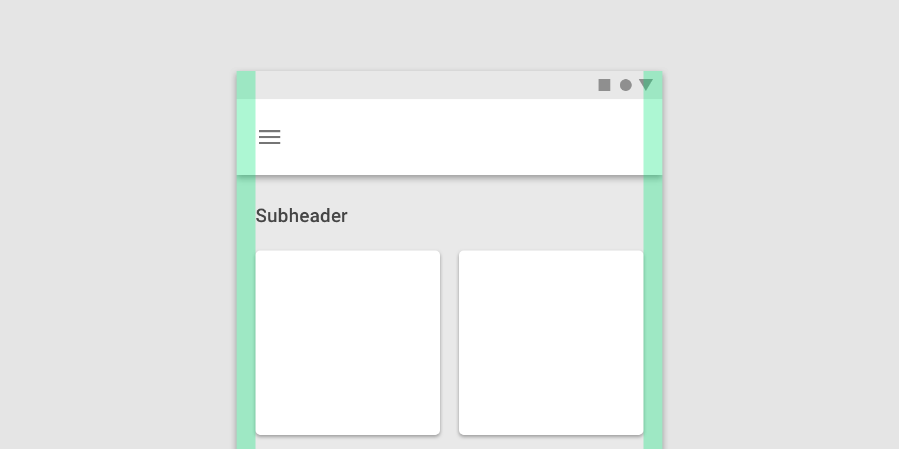
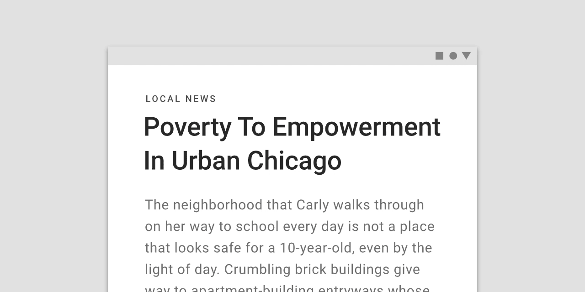

# Training Meterial Design

## I.Tổng quan

Google giới thiệu Material Design vào ngày 25 tháng 6 năm 2014, tại hội nghị Google I/O 2014.

Material Design có thể được sử dụng từ API cấp độ 21 (Android 5.0) trở lên hoặc qua thư viện v7 appcompat

Material Design sẽ dần được mở rộng khắp các trang web của Google và sản phẩm di động của, nhằm đồng bộ trải nghiệm trên khắp các nền tảng và ứng dụng.

Meterial design bao gồm những cách thức thiết kế tốt nhất, quy ước chung và hình ảnh để giúp xây dựng những ứng dụng đẹp, tốt trên bất kì thiết bị nào. Nó tăng khả năng hấp dẫn, cải thiện mức độ tương tác và khả năng dữ chân người dùng.

Một số nguyên tắc thiết kế:

- Màu sắc: sẽ được dùng nhiều để làm nổi bật thành phần chính và phụ trong giao diện người dùng. Có màu chính (main color) và màu phụ (accent color) để cung cấp sự nhất quán xuyên suốt ứng dụng.

- Các chỉ số và đường chính sẽ được dùng để căn và chỉnh nội dung dựa theo lưới 8dp cơ bản, để đảm bảo có thể đọc được cũng như sự nhất quán trong hiển thị. Ngoài ra có thể dùng lưới 4dp.

- Image sẽ ở chế độ tràn. Tối thiểu khoảng cách giữa các ảnh cũng như khoảng cách giữa ảnh và cạnh màn hình sẽ cung cấp nội dung phong phú, tốt hơn cho người dùng

- Chuyển động có ý nghĩa, gồm animation and sự chuyển đổi, sẽ giúp trải nghiệm tốt hơn, tạo sự thú vị

Ngoài ra các thành phần như System status bar, toolbar, tab, button, list, ... cũng sẽ có những trải nghiệm tốt hơn, hợp mắt hơn

## II. Chi tiết

### 1. Layout

### a. Hiểu về layout

Mọi kích cỡ (margin. width, height, ...) nên là bội của 8dp, những cái nhỏ hơn như cỡ icon, cỡ chữ có theo là bội của 4dp

### b. Mật độ điểm ảnh

- Số lượng điểm ảnh mà vừa trên 1 inch được gọi là **mật độ điểm ảnh**

=> Nếu dùng pixel làm đơn vị để đặt cho kích thước của view, khoảng cách thì lúc hiển thị sẽ không thống nhất trên các màn hình

- dp (density-independent pixel): sẽ giúp cải thiện được vấn đề về kích thước trên các màn hình có mật độ khác nhau

Công thức: dp = (width in pixels * 160) / screen density

Cùng một dp sẽ ra các width in pixel khác nhau, phụ thuộc vào density, từ đó sẽ phù hợp với màn hình

sp vs dp:

Ngoài ra còn được áp dụng cho iOS, web

### c. Lưới layout

Sẽ giúp việc tạo layout dạng lưới phù hợp với cỡ màn hình, hướng và đảm bảo tính nhất quán

### Gồm 3 thành phần: cột, rãnh và cách lề  (Columns, gutters, and margins)

- Cột: nội dung được đặt trong khu vực màn hình mà chứa cột. Số cột hiển thị được quy định bởi phạm vi breakpoint. Có bảng quy định việc này

Trên mobile, breakpoint = 360dp, có 4 cột

Trên table, breakpoint = 600dp, có 8 cột

- Rãnh:

- Cách lề: 

### Căn chỉnh lưới

