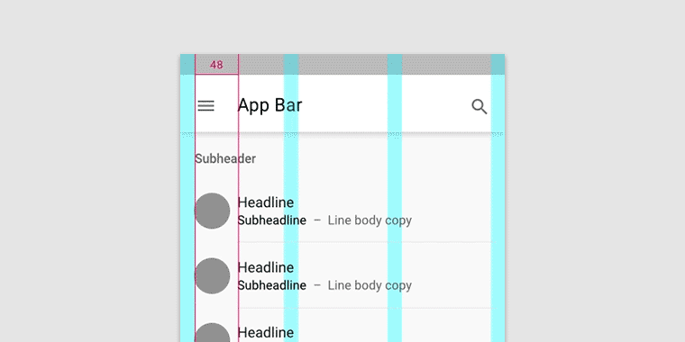
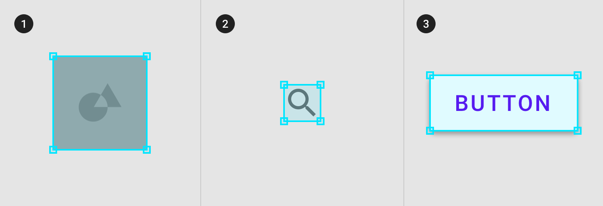

# Training Meterial Design

## I.Tổng quan

Google giới thiệu Material Design vào ngày 25 tháng 6 năm 2014, tại hội nghị Google I/O 2014.

Material Design có thể được sử dụng từ API cấp độ 21 (Android 5.0) trở lên hoặc qua thư viện v7 appcompat

Material Design sẽ dần được mở rộng khắp các trang web của Google và sản phẩm di động của, nhằm đồng bộ trải nghiệm trên khắp các nền tảng và ứng dụng.

Meterial design bao gồm những cách thức thiết kế tốt nhất, quy ước chung và hình ảnh để giúp xây dựng những ứng dụng đẹp, tốt trên bất kì thiết bị nào. Nó tăng khả năng hấp dẫn, cải thiện mức độ tương tác và khả năng dữ chân người dùng.

Một số nguyên tắc thiết kế:

- Màu sắc: sẽ được dùng nhiều để làm nổi bật thành phần chính và phụ trong giao diện người dùng. Có màu chính (main color) và màu phụ (accent color) để cung cấp sự nhất quán xuyên suốt ứng dụng.

- Các chỉ số và đường chính sẽ được dùng để căn và chỉnh nội dung dựa theo lưới 8dp cơ bản, để đảm bảo có thể đọc được cũng như sự nhất quán trong hiển thị. Ngoài ra có thể dùng lưới 4dp.

- Image sẽ ở chế độ tràn. Tối thiểu khoảng cách giữa các ảnh cũng như khoảng cách giữa ảnh và cạnh màn hình sẽ cung cấp nội dung phong phú, tốt hơn cho người dùng

- Chuyển động có ý nghĩa, gồm hiệu úng và sự chuyển đổi, sẽ giúp trải nghiệm tốt hơn, tạo sự thú vị

Ngoài ra các thành phần như System status bar, toolbar, tab, button, list, ... cũng sẽ có những trải nghiệm tốt hơn, hợp mắt hơn

## II. Chi tiết

### 1. Layout

### a. Hiểu về layout

Mọi kích cỡ (margin. width, height, ...) nên là bội của 8dp, những cái nhỏ hơn như cỡ icon, cỡ chữ có theo là bội của 4dp

### b. Mật độ điểm ảnh

- Số lượng điểm ảnh mà vừa trên 1 inch được gọi là **mật độ điểm ảnh**

=> Nếu dùng pixel làm đơn vị để đặt cho kích thước của view, khoảng cách thì lúc hiển thị sẽ không thống nhất trên các màn hình

- dp (density-independent pixel): sẽ giúp cải thiện được vấn đề về kích thước trên các màn hình có mật độ khác nhau

Công thức: dp = (width in pixels * 160) / screen density

Cùng một dp sẽ ra các width in pixel khác nhau, phụ thuộc vào density, từ đó sẽ phù hợp với màn hình

Ngoài ra còn sp là chuyên cho văn bản

Ngoài ra còn được áp dụng cho iOS, web

### c. Lưới layout

Sẽ giúp việc tạo layout dạng lưới phù hợp với cỡ màn hình, hướng và đảm bảo tính nhất quán

### Gồm 3 thành phần: cột, rãnh và cách lề  (Columns, gutters, and margins)

- Cột: nội dung được đặt trong khu vực màn hình mà chứa cột. Số cột hiển thị được quy định bởi phạm vi breakpoint. Có bảng quy định việc này

Trên mobile, breakpoint = 360dp, có 4 cột

Trên table, breakpoint = 600dp, có 8 cột

- Rãnh:

- Cách lề: 

### Căn chỉnh lưới

- Có thể căn chỉnh độ lớn của rãnh để thay đổi khoảng cách giữa các cột. 

Khoảng cách ngắn thì người dùng sẽ hiểu là các thành phần sẽ cùng 1 bộ sưu tập

Khoảng cách lớn hơn thì người dùng sẽ hiểu là các thành phần sẽ độc lập

Không nên để rãnh quá lớn, nó sẽ không đủ chỗ cho nội dung và làm cho việc hiển thị không rõ ràng

### Căn chỉnh lề 

Margin dùng một giá trị cố định cho mỗi breakpoint. 

Không nên để margin quá lớn nếu không sẽ không có đủ không gian cho nội dung.

### Breakpoint

Là độ rộng của màn hình hiển thị. Vs mỗi độ rộng thì layout sẽ được chỉnh để phù hợp vs cỡ màn hình và hướng

Link minh họa:

https://storage.googleapis.com/spec-host/mio-staging%2Fmio-design%2F1563837804615%2Fassets%2F1fsdEL9VNAeJaQjU-bdzLZnZ2IuoPEpYT%2Flayout-responsive-breakpoints.mp4

Bảng sau quy định mối quan hệ giữa breakpoint, cột, cách lề và rãnh

### Vùng giao diện

Layout được tạo nên từ nhiều vùng giao diện, như navigation, nội dung, app bar. Vùng giao diện nên thích hợp giữa trên thiết bị, trong khi phù hợp với mỗi loại breakpoint.

Các cách để xây dựng:

- Màn ngang/dọc, Tablet/Mobile: xây dựng file layout riêng cho màn ngang, dọc

Các loại vùng:

- Vùng dài hạn: có thể được hiển thị ở ngoài grid, ví dụ như navigation drawer

- Vùng Persistent: hiển thị theo mệnh lệnh bất cứ lúc nào, hoặc có thể lúc nào cũng hiển thị. Nó ảnh hưởng tới nội dung và lưới bên trong. Khả năng hiển thị của nó không bị ảnh hưởng khi tương tác vs các thành phần khác trên màn hình

-Vùng tạm thời: xuất hiện tạm thời, không ảnh hưởng tới lưới layout. Khả năng hiển thị của nó bị ảnh hưởng khi tương tác vs các thành phần khác trên màn hình 

### d. Phương thức khoảng cách

Sử dụng lưới cơ sở, keyline, padding và ... để ảnh hưởng tới tỉ lệ, vùng chứa và mục tiêu chạm

### Lưới cơ sở

Các thành phần sẽ được căn theo lưới ô vuông cơ sở 8dp, trên mobile, tablet và desktop. 

Các thành phần nhỏ hơn như ảnh, văn bản, ... có thể căn theo lưới 4dp

Lưới 4dp cơ sở

Khi văn bản được căn giữa thì nó có thể đặt ở ngoài lưới 4dp

### Khoảng cách

- Vị trí đặt thích hợp của thành phần ngoài lưới layout. Nên căn theo lưới 8dp

- Padding: khoảng cách giữa các thành phần, cũng theo lưới 8dp hoặc 4dp

### Vùng chứa và tỉ lệ cạnh

- Vùng chứa: là hình đại diện cho 1 không gian đóng. Có thể chứa nhiều như ảnh, icon hoặc bề mặt

Có 2 loại vùng chứa: cố định và có thay đổi

- Tỉ lệ cạnh: tỉ lệ giữa chiều rộng và chiều dài của thành phần. Ảnh, bề mặt, cỡ màn hình nên tuân theo tỉ lệ để đảm bảo tính nhất quán.

- Để hiển thị ảnh thích hợp, xác định ảnh sẽ được cắt thế nào cho mỗi loại màn hình:

+ Giữ nguyên tỉ lệ

+ Thay đổi theo tùy loại màn hình

+ Giữ nguyên chiều cao, chiều rộng thay đổi

### Vùng chạm

Vùng chạm nên ít nhất 48 x 48 dp, ít nhất 8dp khoảng cách giữa chúng

Ờ màn hình không chạm được, vùng click được nên ít nhất 24 x 24 dp, ít nhất 8dp khoảng cách giữa chúng

### e. Hành vi thành phần 

### Độ rộng của đối tượng

Kích cỡ thành phần có thể thay đổi hoặc cố định trên các loại màn hình khác nhau.

Không nên để kích thước quá nhỏ 

Khi thay đổi kích cỡ màn hình, đối tượng có thể trở nên quá nổi bật ==> Không nên

Khi được push hoặc bị đè lên, kích cỡ sẽ không thay đổi

### Mô hình đáp ứng

- Hiển thị: khi có thêm diện tích thì thành phần có thể được cho hiển thị lên màn hình

- Chuyển đổi: một thành phần có thể chuyển thành dạng khác khi cỡ màn hình thay đổi

- Chia ra: có thể hiện thị toàn bộ nội dung một lần trên giao diện nếu có đủ diện tích

- Tái cấu trúc: khi có thêm diện tích, UI có thể thay đổi kiểu 

- Mở rộng: component có thể mở rộng để phù hợp vs cỡ màn hình

- Vị trí: vị trí component có thể thay đổi để phù hợp vs cỡ màn hình

### e. Áp dụng mật độ

### Áp dụng

- Nguyên tắc mật độ: 

+ Khả năng quét: UI dày đặc cải thiện khả năng tìm kiếm và tương tác với lượng nội dung lớn 

+ Độ ưu tiên: UI dày đặc giúp người dùng tập trung bằng cách giảm khoảng cách giữa các hành động

+ Tính có sẵn: mật độ giúp hiển thị nhiều nội dung, hành động hơn trên màn hình

- Thời điểm áp dụng: mật độ cao hơn, sẽ có nhiều thông tin hơn. List, bảng, form thường hay được áp dụng

### Layout

### Mục tiêu chạm và click

Mục tiêu chạm nên là ít nhất 48 x 48 dp, vs ít nhất 8dp khoảng cách giữa các thành phần

Một số trường hợp cần nhỏ hơn như link trong trong đoạn text, vùng chọn ngày ở date picker 

### 2. Chuyển động

### a. Hiểu về chuyển động

### Sử dụng

- Phân tầng: giúp người dùng biết sự liên hệ giữa các thành phần 

Link minh họa:

https://storage.googleapis.com/spec-host/mio-staging%2Fmio-design%2F1563837804615%2Fassets%2F1DenoCsHNb_H1S1zErzmGCxhz6wjmdO8y%2F01-hierarchy-parentchild.mp4

https://storage.googleapis.com/spec-host/mio-staging%2Fmio-design%2F1563837804615%2Fassets%2F1Dd6n1D56cCcbtKEoM0gxP3OsMKotlTn2%2F01-hierarchy-menu.mp4

- Feedback và trạng thái: cung cấp feedback và trạng thái của hành động người dùng

Link minh họa:

https://storage.googleapis.com/spec-host/mio-staging%2Fmio-design%2F1563837804615%2Fassets%2F1G-MNFco8ApWpcnN5hkbiS2QnK1f1jW-Z%2F02-feedback-password.mp4

https://storage.googleapis.com/spec-host/mio-staging%2Fmio-design%2F1563837804615%2Fassets%2F11YQJCcOncFpVNUXKmmTgvXb9MrlXt60c%2F02-feedback-touch.mp4

Ngoài ra còn giúp chỉ dẫn người dùng, thêm hành động, sự hấp dẫn cho ứng dụng 

### Phân tích sự chuyển tiếp 

Trong quá trình chuyển tiếp, các thành phần của UI sẽ biến đổi

Link minh họa:

https://storage.googleapis.com/spec-host/mio-staging%2Fmio-design%2F1563837804615%2Fassets%2F19k1nBx3oapA8GVx33GEVsbro6wFs91On%2F01-elementtype-topappbar.mp4

### Thể hiện sự liên tục

- Tweening: hiển thị sự liên tục của thay đổi thành phần theo thời gian, những thuộc tinh có khoảng giá trị trung gian thì mới áp dụng được

Link minh họa:

https://storage.googleapis.com/spec-host/mio-staging%2Fmio-design%2F1563837804615%2Fassets%2F1RJ1TKFFa6qwYLHOlmSvCvBguYlHGSUiM%2F01-tweening.mp4

- Fading: sự biến đổi về độ mờ.

Link minh họa:

https://storage.googleapis.com/spec-host/mio-staging%2Fmio-design%2F1563837804615%2Fassets%2F1n_Bt35iyIC-dk7L0BKw54OxDe6dbfrYV%2F02-dissolve.mp4

- Shared transformation: đồng bộ sự chuyển động của thành phần để cải thiện sự liên tục
Shared element: Android 5.0

Link minh họa:

https://storage.googleapis.com/spec-host/mio-staging%2Fmio-design%2F1563837804615%2Fassets%2F127msUeEph5wIZvXKwexUN4_YYp_HWf_W%2F03-cutonaction.mp4

### b. Tốc độ

### Điều chỉnh tốc độ

Tốc độ phù hợp sẽ giúp người dùng hiểu về sự thay đổi trong UI hơn. Nên dùng khoảng thời gian của hiệu ứng ngắn nhất có thể mà ko gây nên sự đột ngột hoặc khó hiểu

### Khoảng thời gian

- Theo độ phức tạp: 

+ Đơn giản: cần thời gian ngắn

Duration là 100ms

Link minh họa:

https://storage.googleapis.com/spec-host/mio-staging%2Fmio-design%2F1563837804615%2Fassets%2F1JuV3ujUJaAZoPn8Y7KGemr8Zi846cMmY%2F01-iconssimple.mp4

+ Phức tạp: cần 200, 300ms, ...

Link minh họa:

https://storage.googleapis.com/spec-host/mio-staging%2Fmio-design%2F1563837804615%2Fassets%2F11blQMsxyud2-41e7tH_Ivg3aZ7wbB7mr%2F01-iconscomplex.mp4

- Thoát và đóng: thời gian cho việc đóng, ẩn đi, ... dùng thời gian ngắn, vì cần ít sự chú ý của người dùng hơn

Mở nav drawer 250ms, đóng 200ms

Link minh họa:

https://storage.googleapis.com/spec-host/mio-staging%2Fmio-design%2F1563837804615%2Fassets%2F1-u7zPNV1Gi7X0eab2W7L15T3yBlAA3Ay%2F02-baseline-enterexit.mp4

Ngoài ra còn theo phạm vị diện tích

### Easing

Cách điều chỉnh tỉ lệ hiệu ứng khi thay đổi. Nên làm cho các thành phần tăng tốc và giảm tốc cùng nhau.

Phân loại: 

- Cơ bản: đặt sự chú ý vào cuối của chuyển động, di chuyển nhanh lúc ban đầu, sau đó hạ về bằng không. Tăng thời gian cho sự giảm tốc. Phần cuối của chuyển động nên gây được sự chú ý. Như thế, người xem sẽ bị thu hút bởi các chuyển động gần cuối và chuyển tiếp sang giai đoạn kế tiếp được mượt mà hơn.

Đây là loại hay dùng, khi không biết dùng cái nào thì có thể dùng cái này

Có đối tượng FastOutSlowInInterpolator trong Android giúp làm điều này

- Giảm tốc: dùng khi một vật thể bất ngờ xuất hiện trên màn hình, di chuyển thật nhanh lúc ban đầu, nhưng về sau chậm lại để người xem có thể nắm bắt được.

Sử dụng đối tượng LinearOutSlowInInterpolator trong Android 

- Tăng tốc: dùng cho 1 đối tượng thoát khỏi màn hình

Sử dụng đối tượng FastOutLinearInInterpolator trong Android 

### c. Sự uyển chuyển

Để người xem cảm nhận được sự uyển chuyển, mềm mại và tự nhiên trong từng chuyển động

### Sự tuần tự: thứ tự xem phần nào được hiển thị, di chuyển và dừng lại. 

Có các loại như: 

- Loại đơn giản: tất cả đối tượng được áp dùng cùng 1 animation

Link minh họa:

https://storage.googleapis.com/spec-host/mio-staging%2Fmio-design%2F1563837804615%2Fassets%2F17t9KO7HB9c0G8gu4NRoPufFG1wlrDm-A%2F01-simplesequencing.mp4

- Loại phức tạp: mỗi thành phần sẽ có 1 chuyển động riêng

Link minh họa:

https://storage.googleapis.com/spec-host/mio-staging%2Fmio-design%2F1563837804615%2Fassets%2F17t9KO7HB9c0G8gu4NRoPufFG1wlrDm-A%2F01-simplesequencing.mp4

###

### d. Tự chỉnh hiệu ứng 

Có thể chỉnh về tốc độ, sự chuyển động, tuần tự, hiệu ứng cho icon, hình minh họa, tối giản hiệu ứng đi

https://material.io/design/motion/customization.html#customization-options

